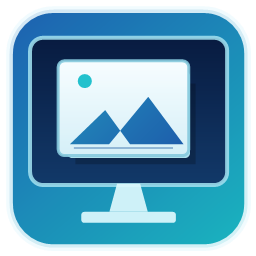

<p align="center">
  
</p>

<h1 align="center">DeskAccess</h1>

<p align="center">
  App-scoped remote access for RDP, SSH, VNC, and selected TCP services.
</p>

DeskAccess is an app-scoped remote access tool for reaching selected services on a machine, such as RDP, SSH, VNC, or a custom TCP port, without opening access to the whole private network.

Instead of installing a full VPN adapter and routing broad network traffic, DeskAccess creates access only for the service you explicitly invite or pair.

## Why DeskAccess

Traditional VPN tools often give broad network reach once a device is connected. DeskAccess is designed for a narrower workflow: share access to one selected service on one machine, then keep the rest of the network out of scope.

It is useful for support, administration, home labs, Raspberry Pi access, and small office remote access where users want a simple invite-based flow instead of managing full network VPN access.

## Use Cases

- Access a Windows desktop over RDP without exposing the whole office LAN.
- Connect to a Linux server or Raspberry Pi over SSH through a pairing link.
- Reach a VNC server on a selected machine.
- Share temporary one-hour access to one local service.
- Create persistent paired access for your own admin device.
- Deploy a relay in an office or lab so admins can manage access to selected machines.

## How It Works

DeskAccess runs in the background on the machine you want to reach. You use the DeskAccess UI to create an invite link and choose what kind of access to allow.

For RDP:

1. Install DeskAccess on the machine you want to access.
2. Open DeskAccess and create an RDP invite link.
3. Send the invite link to the remote user or your admin device.
4. The remote user opens the `deskaccess://` link from email, chat, browser, or any other app.
5. DeskAccess starts the secure connection and opens Remote Desktop.

```text
Remote Desktop
        |
        v
DeskAccess secure connection
        |
        v
Host machine
```

The same flow can be used for SSH, VNC, or a custom TCP port.

DeskAccess registers the `deskaccess://` link type on supported platforms, so invite links open in the DeskAccess app after installation.

Only the selected service is available through the invite. The rest of the network is not opened.

## Network Backends

DeskAccess can use multiple peer-to-peer discovery and connection backends:

- Iroh
- libp2p relay
- libp2p DHT
- BitTorrent DHT with direct QUIC

The app can use publicly available relay/discovery infrastructure to help peers find and reach each other. This is useful for testing and lightweight use, but public infrastructure is best-effort and can be rate-limited, unavailable, or blocked by some networks.

For reliable production use, users should host their own relay server. A self-hosted relay gives the administrator control over availability, ACLs, reservation limits, and machine access policy.

## Public Relay vs Self-Hosted Relay

Public relay servers are convenient because they require no setup. They are suitable for demos, testing, and occasional remote access.

Self-hosted relay servers are recommended when reliability matters. With your own relay, you can:

- Keep relay capacity reserved for your own users.
- Control which machines can use the relay.
- Avoid public relay rate limits.
- Keep office/admin access policy under your own control.
- Deploy the relay as a Linux container or service.

## Security Model

DeskAccess is designed around scoped access:

- Only selected apps/services are exposed.
- Access is passwordless at the DeskAccess layer: connections are secured by machine certificates instead of shared passwords.
- Invites can be temporary or persistent pairing links.
- Pairing can add a trusted machine to the allowed list.
- The host verifies the requested loopback target and port.
- TPM-backed identity and hardware machine ID can be used where available, with software identity fallback.

### End-to-End Encryption

DeskAccess sends RDP, SSH, VNC, and custom TCP data over encrypted connections between the two DeskAccess endpoints. Intermediate relay, discovery, DHT, DNS, or bootstrap servers can help peers find each other or forward encrypted traffic, but they are not given the plaintext service data.

Each DeskAccess endpoint proves its identity with certificates during pairing and connection. When hardware-backed identity is available, the certificate is tied to the machine hardware ID; otherwise DeskAccess falls back to a software identity.

Backend behavior:

- Iroh uses encrypted endpoint connections with DeskAccess-specific ALPNs for pairing and tunnel traffic. Iroh relays forward encrypted endpoint traffic.
- libp2p relay and libp2p DHT use encrypted libp2p streams between DeskAccess peers. Relay nodes forward encrypted streams, and DHT nodes are used for discovery/provider records rather than tunnel payload.
- BitTorrent DHT is used only for discovery. Service data is sent over direct QUIC/TLS streams between the DeskAccess peers.

Some metadata can still be visible to intermediate infrastructure, such as peer IDs, timing, relay usage, public addresses, and discovery records needed to connect peers. The selected local service still sees plaintext at the host/client loopback endpoints, as expected, but the data carried across the network is encrypted by the selected backend transport.

DeskAccess is not intended to expose an entire subnet like a traditional VPN. Its goal is narrower: remote access to specific services on specific machines.

## Platforms

Current target platforms:

- Windows
- Linux
- Raspberry Pi
- Android client work in progress

On Windows and Linux, DeskAccess is designed as an always-running service with a local UI/tray or browser interface communicating with that service.

## Building

Windows:

```powershell
go build -ldflags="-s -w -H=windowsgui" -o build\DeskAccess.exe ./cmd/deskaccess
```

Raspberry Pi / Linux arm64:

```powershell
$env:GOOS='linux'
$env:GOARCH='arm64'
$env:CGO_ENABLED='0'
go build -ldflags='-s -w -X main.version=0.1.0-pi' -o build\deskaccess-linux-arm64 ./cmd/deskaccess
```

Linux packages can be built with:

```bash
build/package-linux.sh
```

Windows MSI packaging can be built with:

```powershell
build\package-msi.ps1
```

## Relay Server

The repository includes a basic relay server under:

```text
cmd/relay-server
```

A self-hosted relay is the recommended option for dependable access. Public relay servers may work, but they should not be treated as guaranteed infrastructure.

## Status

DeskAccess is under active development. Interfaces, protocols, and packaging may change as the project matures.
